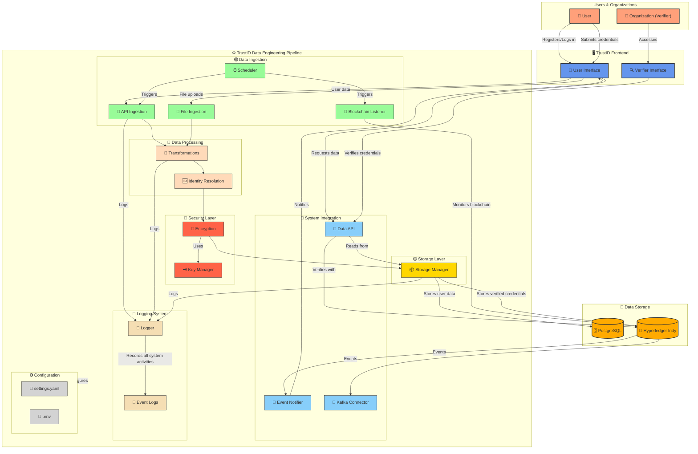

# 🚀 TrustID: Blockchain-Powered Digital Identity Verification




TrustID is a blockchain-powered digital identity verification system that ensures secure, tamper-proof, and verifiable credentials. Built on **Hyperledger Indy** and **PostgreSQL**, TrustID allows users to manage and share their credentials (e.g., National ID, Passports, Degrees) with organizations in a privacy-preserving, decentralized way.

## 🔹 Key Features
- ✅ **Decentralized Identifiers (DIDs)** for secure user authentication
- ✅ **Verifiable Credentials** stored on blockchain for authenticity
- ✅ **Automated Data Extraction** using OCR/AI for easy document verification
- ✅ **Revocation Registry** to track and prevent fraudulent credentials
- ✅ **Seamless Integration** for organizations to verify credentials in real-time


## 🛠 Technologies Used

| Component            | Technology Used |
|----------------------|----------------|
| **Blockchain Ledger** | Hyperledger Indy  → Decentralized Identity Ledger |
| **Database**        | PostgreSQL → User & Credential Storage |
| **Encryption**      | OpenSSL  → Encryption & Key Management |
| **Backend**        | Node.js |
| **Version Control** | Git & GitHub |
| **Dev Environment** | VS Code, Jupyter Notebook |
| **scripting** | Python|

---


## 📌 Our Mission
To provide a trustworthy, efficient, and privacy-centric digital identity system for seamless verification across industries like **finance, healthcare, and education**.


---


## Project Structure

```
TrustID-DataEngineering/
├── data_ingestion/
│   ├── blockchain_listener.py  # Monitors Hyperledger Indy for changes
│   ├── api_ingestion.py        # Fetches user data from the app
│   ├── file_ingestion.py       # Processes CSV/JSON credential uploads
│   ├── scheduler.py            # Automates data ingestion jobs
│
├── data_processing/
│   ├── transformations.py      # Data cleaning, formatting, deduplication
│   ├── encryption.py           # Handles OpenSSL-based encryption
│   ├── identity_resolution.py  # Prevents duplicate identity records
│
├── storage/
│   ├── models/
│   │   ├── blockchain_schema.sql  # Schema for Hyperledger Indy storage
│   │   ├── relational_schema.sql  # PostgreSQL schema for user/credential data
│   │   ├── document_store.json    # (Optional) NoSQL schema for extra metadata
│   ├── storage_manager.py        # Manages reading/writing to databases
│
├── integration/
│   ├── data_api.py               # Provides API endpoints for data retrieval
│   ├── event_notifier.py         # Sends notifications when credentials update
│
├── config/
│   ├── settings.yaml             # Configuration settings
│   ├── secrets.env               # Environment variables (DO NOT COMMIT)
│
├── tests/
│   ├── test_ingestion.py         # Tests data ingestion scripts
│   ├── test_processing.py        # Tests data processing functions
│   ├── test_storage.py           # Tests storage interactions
│
├── scripts/
│   ├── setup_db.py               # Initializes databases
│   ├── load_sample_data.py        # Loads test credential data
│
├── docs/
│   ├── architecture.md           # Explanation of data flow & design
│   ├── storage_design.md         # Database schema details
│
├── requirements.txt              # Python dependencies
├── README.md                     # Project overview
├── .gitignore                     # Ignore unnecessary files
```


## 📌 Explanation of Folders

### 🟢 `data_ingestion/`
Handles collecting and importing data from different sources:
- **`blockchain_listener.py`** → Monitors Hyperledger Indy for new/verifiable credentials.
- **`api_ingestion.py`** → Extracts user & credential data from the app.
- **`file_ingestion.py`** → Loads credentials uploaded as CSV/JSON.
- **`scheduler.py`** → Automates ingestion tasks (e.g., periodic updates).

### 🔵 `data_processing/`
Processes and cleans incoming data:
- **`transformations.py`** → Cleans, formats, and deduplicates data.
- **`encryption.py`** → Encrypts user credentials using OpenSSL.
- **`identity_resolution.py`** → Ensures unique identities (prevents duplicates).

### 🟡 `storage/`
Manages where and how data is stored:
- **`models/`** → Contains schemas for databases.
  - `blockchain_schema.sql` → Structure for storing verified credentials on Hyperledger Indy.
  - `relational_schema.sql` → Structure for storing user data & unverified credentials in PostgreSQL.
  - `document_store.json` → (Optional) JSON-based structure for extra metadata.
- **`storage_manager.py`** → Controls data storage and retrieval.

### 🟠 `integration/`
Links the data pipeline to the app and verification processes:
- **`data_api.py`** → API that allows the app to access stored credentials.
- **`event_notifier.py`** → Sends alerts when a credential is updated or verified.

### 🟣 `config/`
Stores configuration files:
- **`settings.yaml`** → Configurations for ingestion, storage, and security.
- **`secrets.env`** → Stores sensitive environment variables (e.g., DB passwords).

### ⚪ `tests/`
Ensures correctness with automated testing:
- **`test_ingestion.py`** → Tests if data ingestion works as expected.
- **`test_processing.py`** → Tests data cleaning and transformation logic.
- **`test_storage.py`** → Ensures proper database interactions.

### ⚫ `scripts/`
Helper scripts for setting up the system:
- **`setup_db.py`** → Initializes PostgreSQL and Hyperledger Indy.
- **`load_sample_data.py`** → Adds sample credentials for testing.

### 📜 `docs/`
Contains documentation:
- **`architecture.md`** → Explains how data flows through the system.
- **`storage_design.md`** → Describes the database schemas.


## ✅ Summary of TrustID's Data Flow

1. **Users register** on the TrustID app, entering personal info & credentials.
2. **Data ingestion** collects user data via API, files, and blockchain events.
3. **Processing layer**:
   - Cleans data.
   - Encrypts credentials.
   - Prevents duplicate identities.
4. **Storage**:
   - **PostgreSQL**: Stores unverified credentials & user metadata.
   - **Hyperledger Indy**: Stores only **verified** credentials.
5. **Verification Requests**:
   - A **verifier** requests access to a credential.
   - System checks Hyperledger Indy for verified credentials.
   - If found, **access is granted**; if not, the user is asked to verify.
6. **Users can share** their credentials securely through the system.

---


